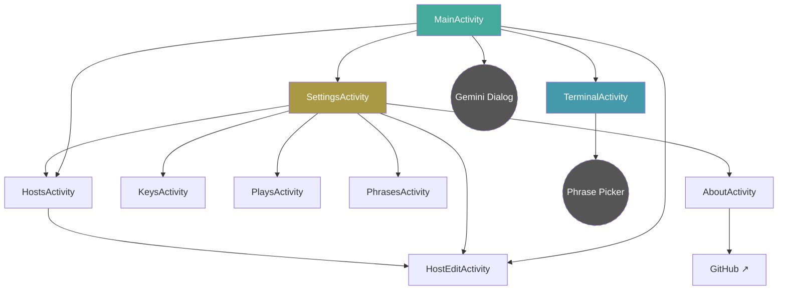
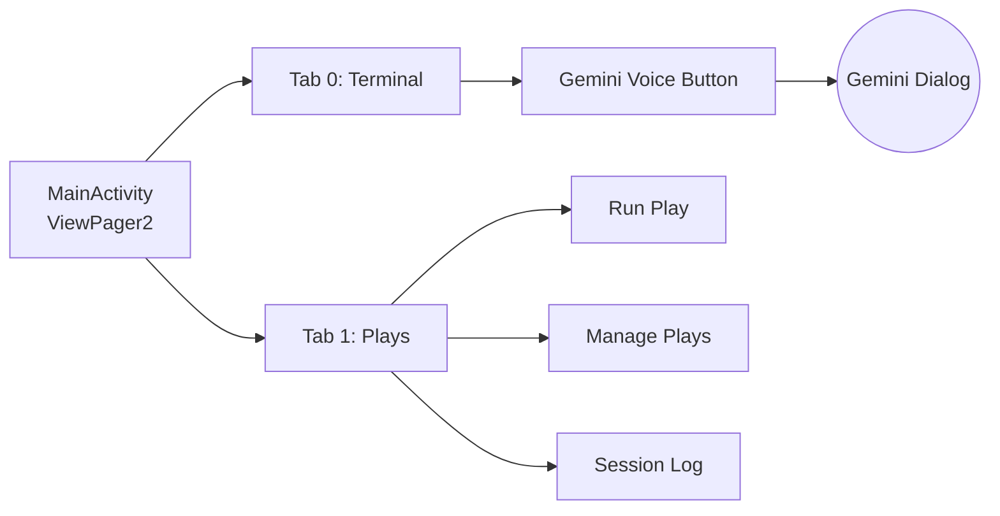
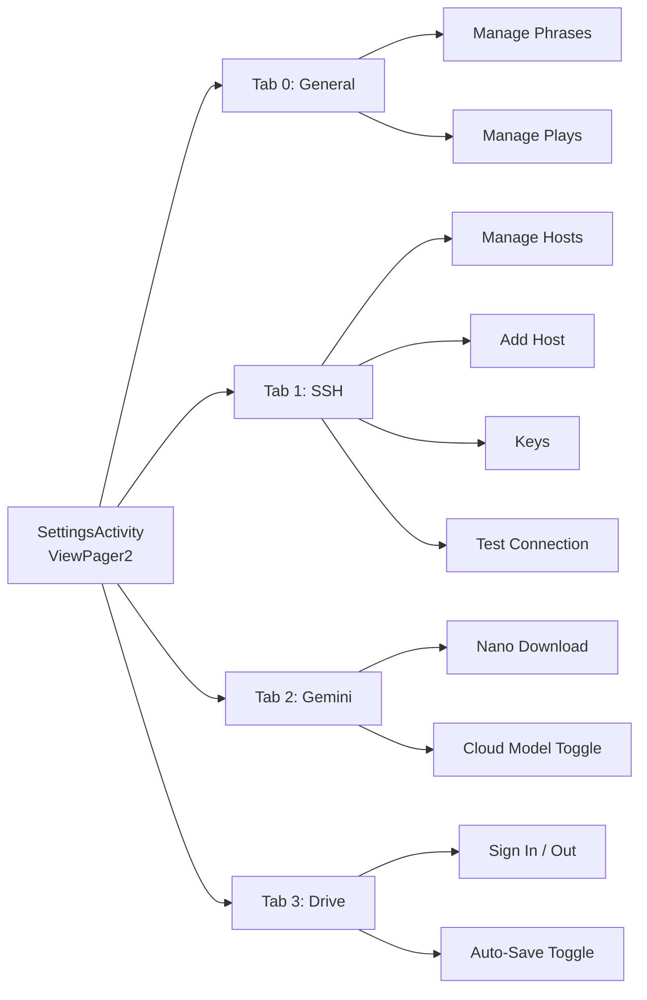
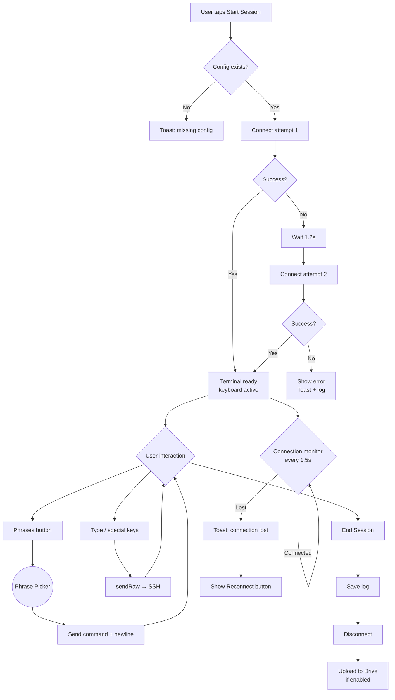
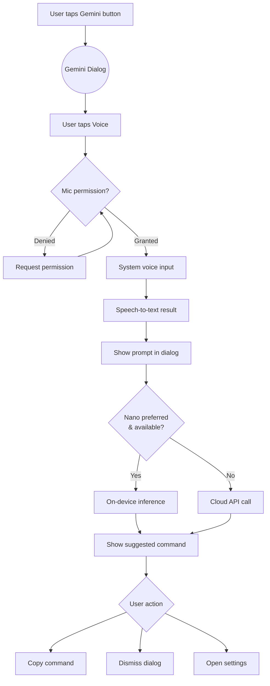
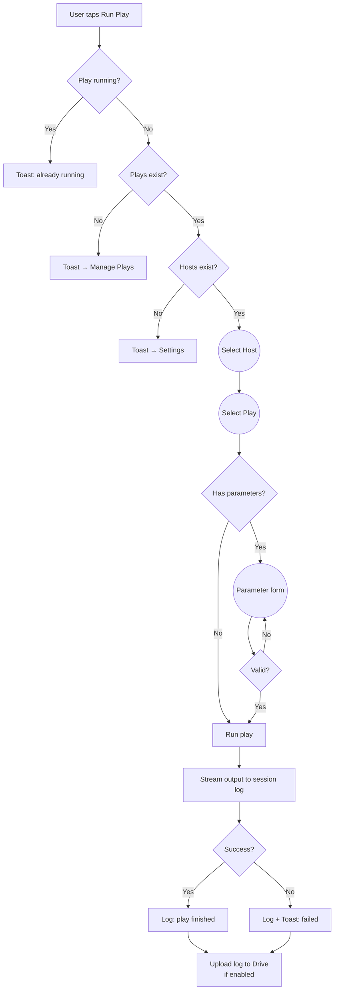
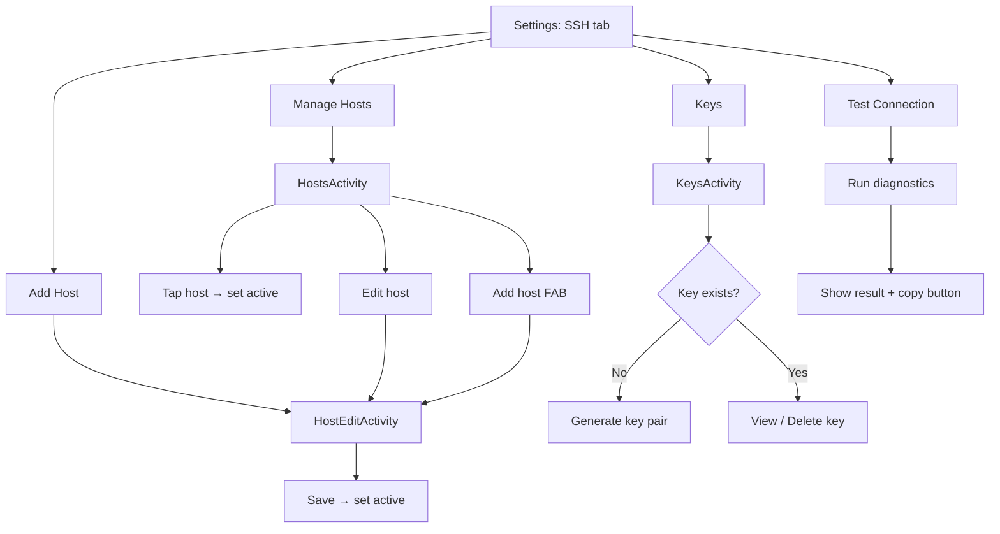
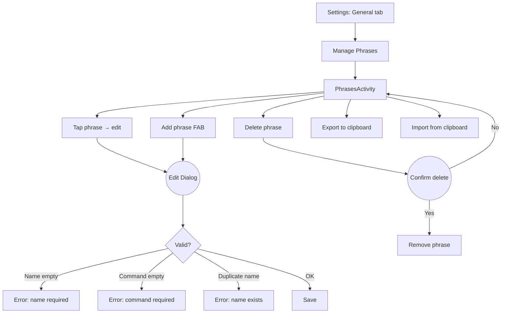

# UX Flows

Mermaid diagrams documenting the navigation structure and key user journeys in Sushi.

---

## App Navigation Map

Dashed borders = dialogs (not separate activities).

---

## MainActivity Tabs

---

## SettingsActivity Tabs

---

## Terminal Connection Flow

---

## Gemini Voice Flow

---

## Play Execution Flow

---

## Host & Key Management Flow

---

## Phrase Management Flow

